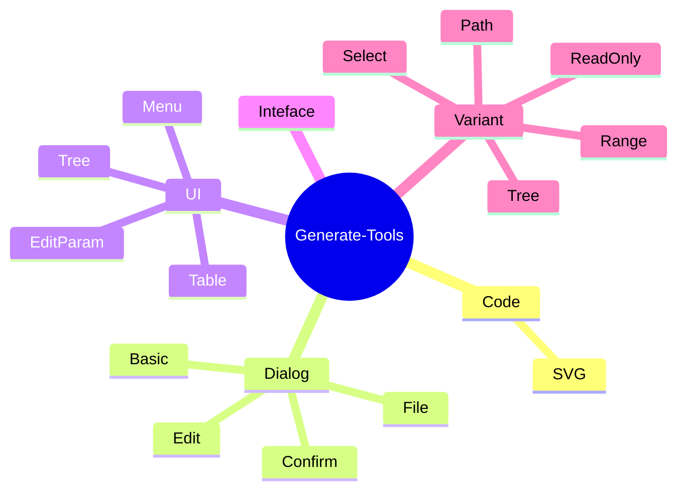
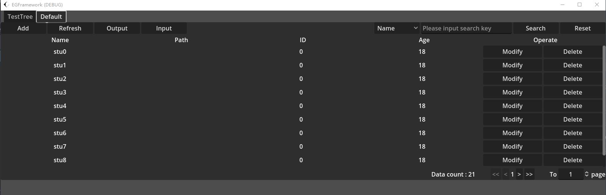
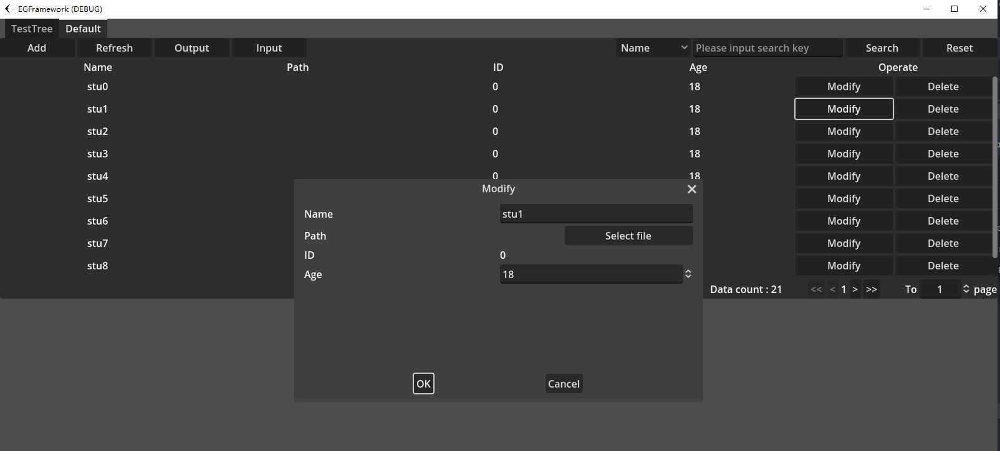
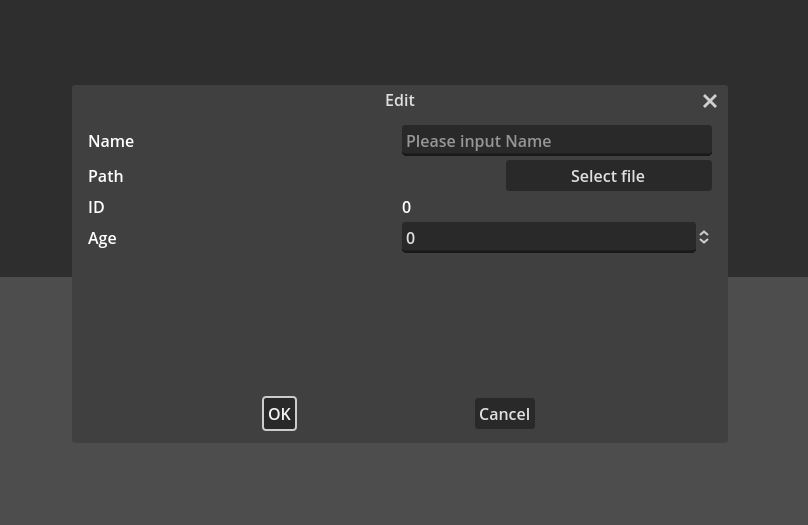
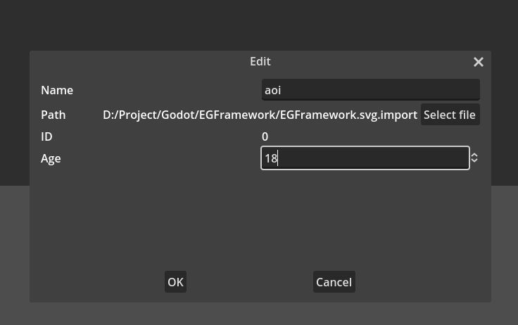
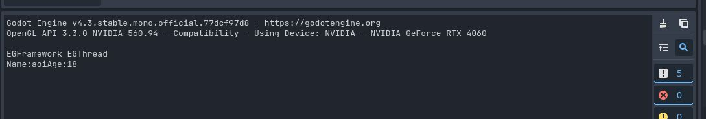

# GenerateTools使用手册

> GenerateTools旨在生成任何应用程序中的组件，变量，对象，以及用到的一些流程等等。同时依赖于Save Tools强大的本地文件加载能力，Generate Tools可以通过配置各种文件实现界面的简单生成，菜单的生成，可编辑表格，可编辑项。
>
> 再此之上，有些通用模板也会放在此工具下，方便扩展与生成。



## 📈生成一个可编辑表格

定义数据类，以学生信息为例

```csharp
public struct DataStudent
{
    public int ID;
    public string Name { get; set; }
    public int Age;
    public EGPathSelect Path { set; get; }
    public DataStudent(string name, int age)
    {
        Name = name;
        Age = age;
        ID = 0;
        Path = new EGPathSelect();
    }
}
```

实例化一组学生信息对象列表，然后通过EGodotTable来对该列表进行初始化

```csharp
public void TestTable()
{
    container = this.GetNode<TabContainer>("TabContainer");
    List<DataStudent> dataStudents = new List<DataStudent>();
    for (int stu = 0; stu < 10; stu++)
    {
        dataStudents.Add(new DataStudent("stu" + stu, 18));
    }
    for (int stu = 0; stu < 11; stu++)
    {
        dataStudents.Add(new DataStudent("A" + stu, 20 + stu));
    }
    EGodotTable table = container.CreateNode<EGodotTable>("Default");
    table.InitData<DataStudent>(dataStudents);
}
```

运行结果如下





## 🌲生成一个树

定义一个Json，使用EGodotTree来对该Json进行初始化

```csharp
public void TestTree()
{
    string json = @"{
        'CPU': 'Intel',
        'PSU': '500W',
        'My' : {
            'AA':'BB',
            'Date': 111
        }
    }";
    container = this.GetNode<TabContainer>("TabContainer");
    EGodotTree eGodotTree = container.CreateNode<EGodotTree>("TestTree");
    eGodotTree.InitByJson(json);
}
```


## 🚪生成一个可编辑弹窗并弹出

使用上述定义过的DataStudent，我们创建一个可编辑弹窗，并且在弹窗编辑完成后打印编辑后的内容。由于Godot子节点先加载，父节点后加载的机制，需要等待父节点实例化之后才能调用弹窗功能，我们使用一个延时方法（参考NodeExtension-EGThread部分），延时弹出该弹窗。

```csharp
public void TestDialog()
{
    DataStudent dataStudent = new DataStudent();
    dataStudent.EGenerateDictiontaryByObject();
    this.ExecuteAfterSecond(() =>
    {
        this.EGEditDialog(new DataStudent().EGenerateDictiontaryByObject(), e =>
        {
            GD.Print("Name:" + e["Name"] + "Age:" + e["Age"]);
        }, "Edit");
    },0.2f);
}
```

调用该方法后会弹出空白弹窗



输入内容



点击确认，控制台输出姓名与年龄的信息，此时您可以使用SaveTools写入本地配置文件，或者是数据库，再或者向后台，上位机或下位机发送该信息。


