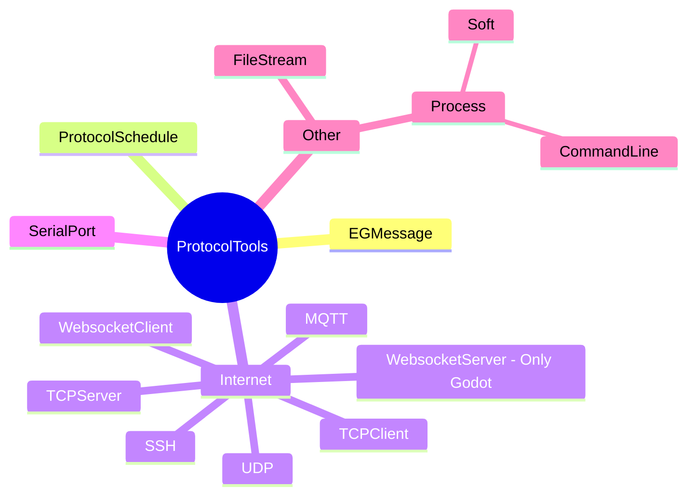
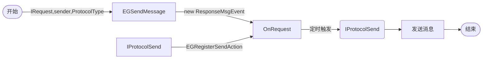
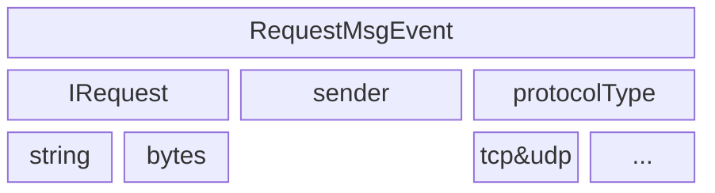
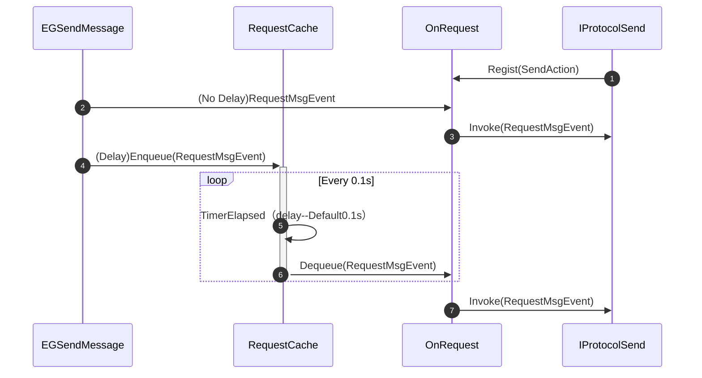
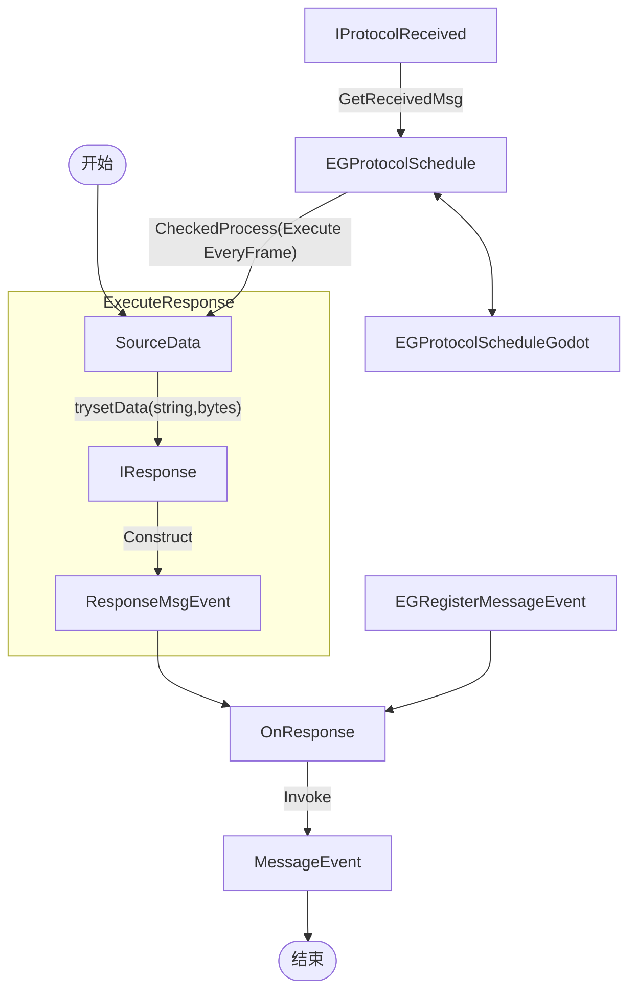
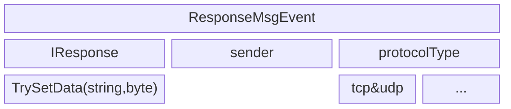
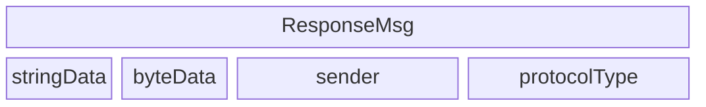
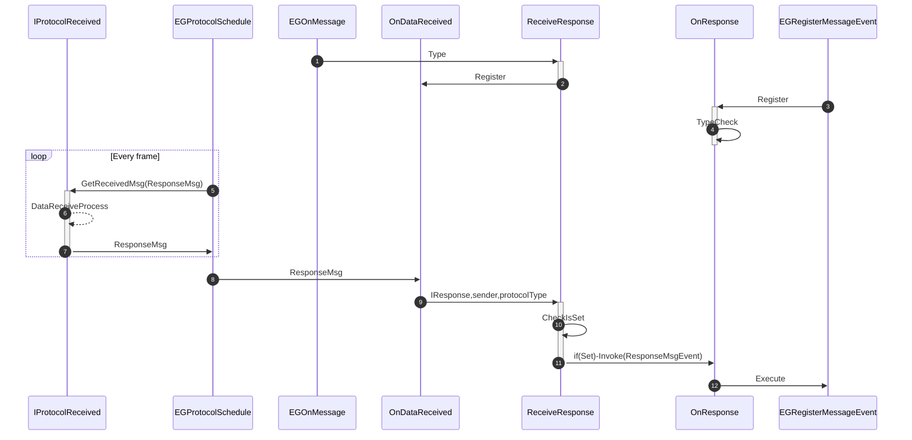

# Protocol Tools 使用指南

> 本指南首次修订于：2025.6.13
>
> 最后修改日期：2025.6.13

Protocol Tools允许您在任何通讯物理层发送信息、接受服务器返回的信息、过滤您的脏数据。

目前工具以发布+订阅的方式处理消息，后续会增加问答的方式处理消息。


本指南中，您将学到以下内容

- 如何在互联网&串口通讯&文件读写&进程吞吐中，发送您的请求，获取您的响应消息。
- 如何自定义消息类，发送您的消息，处理远端响应的消息。
- 自定义插拔式的开启或关闭消息处理功能。
- Protocol Tools的消息解耦原理


Protocol Tools 的结构如下




---

# 目录

[TOC]


---

# 写在使用前

发送请求之前，需要进行连接并检查连接状态，此处按TCPClient为例

```csharp
public async void Init()
{
   await this.EGTCPClient().ConnectTCP("127.0.0.1",6000);
}
//在Ready中调用
public override void _Ready()
{
    Init();
}
```


# 发送请求部分

## 1. 定义您的请求

发送请求是通讯的第一步，如果您只需要连接到对应的服务器，接受对应的推送，而无需发送任何消息请移步至 [4. 定义您的响应](## 4. 定义您的响应)

新建一个结构类`DataStudent`

```csharp
    public struct DataStudent{
        public string Name { get; set; }
        public int Age;
        public int ID;
        public DataStudent(string name,int age){
            Name = name;
            Age = age;
            ID = 0;
        }
    }
```

实现`IRequest`接口

`IRequest`包含两种输出最终发送结果的方法，如果您需要发送字符类型的数据格式，请实现`ToProtocolData`这个方法，如果您需要发送Hex类型的数据格式，请实现`ToProcotolByteData`这个方法。

注意：切勿实现两个方法，实现两个方法会同时发送字符类型+Hex类型两种数据格式的拼接（字符在前，Hex在后，因为字符根据Encoding会转码成未知的Hex数据，不推荐这样做），请实现其中一个，另外一个使用 `return null` 来填补空缺

```csharp
public struct DataStudent :IRequest{
        public string Name { get; set; }
        public int Age;
        public int ID;
        public DataStudent(string name,int age){
            Name = name;
            Age = age;
            ID = 0;
        }

        public string ToProtocolData()
        {
            return JsonConvert.SerializeObject(this);
        }

        public byte[] ToProtocolByteData()
        {
            return null;
        }
    }
```


## 2. 发送您的请求

定义好您的请求后，在特定类的代码域里可以通过`this.EGSendMessage<T>(T t)`发送您的请求，该类需要实现`IEGFramework`

该方法包含三个参数，实现`IRequest`的数据对象，发送对象（sender），以及协议类型。

发送对象一般为注册过的连接，包含IP地址以及端口等参数。

```csharp
    public partial class ViewTestStudent : Node,IEGFramework
    {
        public override void _Ready()
        {
            this.EGSendMessage<DataStudent>(new DataStudent(), "127.0.0.1:6000", ProtocolType.TCPClient);
        }
    }
```

## 3. 设定您的发送间隔

您有没有发现，在您连续发送两条消息的时候，会产生一个0.1s左右的间隔，这个设计是为了防止连续多次发送消息的时候产生粘包现象，如果您需要立即发送，或者是延长这个间隔，可以通过以下方式设定发送间隔。

```csharp
// 两消息之间设定无间隔，立刻发送 
this.GetModule<EGMessage>().SetDelay(0);
// 两消息之间设定间隔1s后再发送 
this.GetModule<EGMessage>().SetDelay(1000);
```


---

# 处理响应部分

## 4. 定义您的响应

当连接到服务器时，如果您先发起请求，此时服务器会处理您的请求，有一段时间的空白期，或者该服务器是广播型服务器，即使不发送请求，也会推送数据给您。

新建一个结构类`DataStudent`

```csharp
public struct DataStudent{
    public string Name { get; set; }
    public int Age;
    public int ID;
    public DataStudent(string name,int age){
        Name = name;
        Age = age;
        ID = 0;
    }
}
```

实现`IResponse`接口

`IResponse`包含两个输入数据的参数的方法用来过滤请求数据，建议您在这个方法内使用try catch 函数，以防止在程序处理异常时中断程序。如果您需要按照hex格式处理或者按照字符格式处理，请在这个函数里面写明对应的方法。

该实现方法会返回一个布尔值的变量，如果返回true，则认同这个消息为该类型的消息并对该条消息进行事件处理。如果返回false，则不认同，也不会对该条消息进行事件处理。

```csharp
    public struct DataStudent :IResponse{
        public string Name { get; set; }
        public int Age;
        public int ID;
        public DataStudent(string name,int age){
            Name = name;
            Age = age;
            ID = 0;
        }

        public bool TrySetData(string protocolData, byte[] protocolBytes)
        {
            try
            {
                DataStudent input = JsonConvert.DeserializeObject<DataStudent>(protocolData);
                if (this.Name == "")
                {
                    return false;
                }
                else
                {
                    this.Name = input.Name;
                    this.Age = input.Age;
                    this.ID = input.ID;
                    return true;
                }
            }
            catch (System.Exception)
            {
                return false;
            }
        }
    }
```

## 5. 注册响应的处理事件

定义好您的响应后，您可以通过注册响应处理事件`this.EGRegisterMessageEvent<T>(Action<T> a)`实现收到该消息并处理。注册事件中有三个参数可以选择，分别是收到的消息本身的结构体&对象，发送对象（sender），以及协议类型。消息可以无关通讯协议的类型，做到任何连接推送的消息都能收到并按照注册的事件进行处理。

同时，注册事件结束后，必须手动开启消息处理`EGOnMessage`，如果有需要，也可以在处理完消息之后关闭消息处理。

```csharp
    public partial class ViewSaveSystem : Node,IEGFramework
    {
        public override void _Ready()
        {
            this.EGRegisterMessageEvent<DataStudent>((data,sender,protocol) =>
            {
                GD.Print(data.Name);
                // 关闭消息处理
                this.EGOffMessage<DataStudent>();
            });
            // 开启消息处理
            this.EGOnMessage<DataStudent>();
        }
    }
```

## 6. 启用对应的协议工具

在场景中的Node下，注册改脚本并启用对应的协议工具，切记，所有通讯工具必须实现`IProtocolReceived`接口，大部分可用的通讯工具均以EG开头。

```csharp
    public partial class ViewSaveSystem : Node,IEGFramework
    {
        public override void _Ready()
        {
            // 启用对应的协议工具,此处以TCP客户端为例，需要其它协议开启对应的工具即可
            this.EGEnabledProtocolTool<EGTCPClient>();
            // 处理消息部分
            this.EGRegisterMessageEvent<DataStudent>((data,sender,protocol) =>
            {
                GD.Print(data.Name);
                // 关闭消息处理
                this.EGOffMessage<DataStudent>();
            });
            // 开启消息处理
            this.EGOnMessage<DataStudent>();
        }
    }
```

# 补充一点私货

如果您对Protocol Tools的底层运行有兴趣，可以看看这部分。如有不足之处，欢迎提供相关改进建议。

## 7.关于运行原理

本部分内容可能比较抽象，比较难以用文字表达，故设计了下列若干图来展示具体的内容部分。

### 消息发送机制 

对应函数EGSendMessage

---

注：

1. IProtocolSend表示实现了该发送消息接口的工具类。
2. RequestMsgEvent表示中途构建的消息结构体，结构体的发送内容必须包含：发送内容（实现IRequest，参考上述定义您的请求部分。）、发送对象、协议类型。
3. RequestCache为延时发送的队列，实现延时出队的功能。
4. OnRequest为EasyEvent<RequestMsgEvent>类型的消息结构体委托，用于推送给所有注册发送功能的具体通讯对象。

---




消息结构体构建




消息发送序列图



### 消息接收机制

对应EG(On&Off)Message，EGRegisterMessageEvent





消息结构体构建 

ResponseMsgEvent



ResponseMsg



消息接收序列图

注：ReceiveResponse实际为EGOnMessage&EGOffMessage注册的委托



