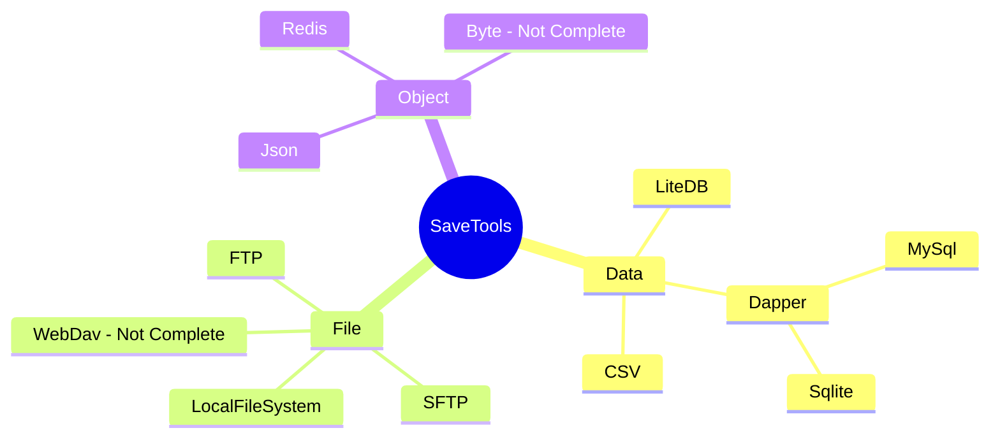

# SaveTools使用手册

---

注：SaveTools 目前因为接口反复修改的关系，Load方法增加对象的返回值以提供更多的操作方法。下面Not Complete表示该部分功能并未开发完毕。



## 支持的数据类型

- `Object` 对象类型的存储类型，通过key-value的方式获取对应的对象，常见的例子有Json，Redis等等。
- `Data`  数据类型的存储类型，同样通过key-Table的方式获取对应的数据表，通常为各种类型的数据库，比如MySql，Sqlite，LiteDB，CSV表格文件等等。
- `File` 文件类型的存储类型，提供对应的下载，上传接口以及各类文件系统管理接口，通常为各种文件共享服务，比如FTP，WebDav，本地文件系统等等。


## 加载存储管理对象（可读可写）

Load为可读写存储对象的加载，通常是用Path，或者数据库地址来进行实例化。

以SQLite数据库为例

```csharp
 EGSqliteSave SqliteTest = this.EGSave().Load<EGSqliteSave>("SaveData/test.db");
```

具体使用方法详见API - IEGSaveData部分。

## 读取存储管理对象（只读）

Read为只读存储对象的加载，通常以字符&字节流的方式来获取，由于是只读数据，仅包含相关数据的搜索，获取功能。

以Json为例

```csharp
string json = @"{
                'CPU': 'Intel',
                'PSU': '500W',
                'Drives': [
                    'DVD read/writer'
                    /*(broken)*/,
                    '500 gigabyte hard drive',
                    '200 gigabyte hard drive'
                ],
                'My' : {
                    'AA':'BB',
                    'Date': new Date(123456789)
                }
            }";
EGJsonSave jsonManage = this.EGSave().Read<EGJsonSave>("Example", json);
GD.Print(jsonManage.GetObject<string>("CPU"));
```

## 开发计划（随版本更新）

Object：

- [x] Json

- [x] Redis

- [ ] Byte

- [ ] etc...

Data：

- [x] LiteDB
- [x] Dapper
- [x] Sqlite
- [x] MySql
- [x] Csv
- [ ] etc...

File：

- [x] LocalFile
- [x] Ftp
- [x] SFtp
- [ ] WebDav


---

# EGSave 使用说明

## 属性

暂无

## 方法

| 方法名                                                                                                      | 简介               |
| -------------------------------------------------------------------------------------------------------- | ---------------- |
| void LoadDataFile<TSaveData>(string path)                                                                | 加载数据文件（需要路径）     |
| void ReadData<TReadOnlyData>(string key,string data)                                                     | 读取数据（需获取字符串原始值）  |
| void ReadData<TReadOnlyData>(string key,byte[] data)                                                     | 读取数据（需获取字节流原始值）  |
| void LoadObjectFile<TSaveObject>(string path)                                                            | 加载对象文件（需要路径）     |
| void ReadObject<TReadOnlyObject>(string key,string data)                                                 | 读取对象（需获取字符串原始值）  |
| void ReadObject<TReadOnlyObject>(string key,byte[] data)                                                 | 读取对象（需获取字节流原始值）  |
| void Unload(string keyOrPath)                                                                            | 卸载数据             |
| List<string> GetKeys()                                                                                   | 获取所有加载过的key或者路径值 |
| void SetObject<TObject>(string path,string objectKey,TObject obj)                                        | 设置对象（写入文件）       |
| TObject GetObject<TObject>(string path,string key)                                                       | 获取对象（读取文件）       |
| void SetData<TData>(string path,string dataKey,TData data,int id)                                        | 设置数据（写入文件）       |
| TData GetData<TData>(string keyOrPath,string key,int id)                                                 | 获取单个数据（读取文件）     |
| IEnumerable<TData> GetAllData<TData>(string keyOrPath,string key)                                        | 获取全部数据（读取文件）     |
| IEnumerable<TData> FindData<TData>(string keyOrPath,string key,Expression<Func<TData, bool>> expression) | 查找符合条件的对应数据      |
| OpenResPath()                                                                                            | 打开Res文件目录        |
| OpenUserPath()                                                                                           | 打开User文件目录       |

## 扩展方法

| 方法名                                         | 简介             |
| ------------------------------------------- | -------------- |
| this.EGSave()                               | 使用存储模块         |
| [string].GetGodotResPath(this string path)  | 转为res文件下的相对路径  |
| [string].GetGodotUserPath(this string path) | 转为User文件下的相对路径 |

## 属性说明

暂无

## 方法说明

### LoadDataFile<T>(string path)

从路径中加载数据文件，因为是可读写，所以必须指定对应的文件路径位置，如果不存在该文件则会新建对应数据文件。

- T：指代任何一个数据存储工具类

- Path：文件的相对路径&绝对路径

```csharp
string Path1 = "Data/Test1.csv".GetGodotResPath();
this.EGSave().LoadDataFile<EGCsvSave>(Path1);
```

### ReadData<T>(string key,string data)

### ReadData<T>(string key,byte[] data)

从文本数据中读取数据，并且赋予对应的key值方便索引到该数据位置上。由于是只读数据，不会创建文件，也不会存在路径信息。

- T：指代任何一个数据工具类

- key：数据的索引，用于定位数据内容。

- data：原始数据，字符串格式或者byte[]字节流。

```csharp
FileAccess testCsv = FileAccess.Open("res://TestCsv.csv", FileAccess.ModeFlags.Read);
this.EGSave().ReadData<EGCsvSave>("TestCsv",testCsv.GetAsText());
```

### LoadObjectFile<T>(string path)

从路径中加载对象文件，因为是可读写，所以必须指定对应的文件路径位置，如果不存在该文件则会新建对应数据文件。

- T：指代任何一个对象存储工具类

- Path：文件的相对路径&绝对路径

```csharp
string Path2 = "Data1.json".GetGodotResPath();
this.EGSave().LoadObjectFile<EGJsonSave>(Path2);
```

### ReadObject<T>(string key,string data)

### ReadObject<T>(string key,byte[] data)

从文本数据中读取对象，并且赋予对应的key值方便索引到该数据位置上。由于是只读对象，不会创建文件，也不会存在路径信息。

- T：指代任何一个对象工具类

- key：对象的索引，用于定位对象内容。

- data：原始数据，字符串格式或者byte[]字节流。

```csharp
FileAccess testJson = FileAccess.Open("res://TestJson.json", FileAccess.ModeFlags.Read);
this.EGSave().ReadObject<EGJsonSave>("TestJson",testJson.GetAsText());
```

### Unload(string keyOrPath)

卸载已读取或者加载的数据，并删除对应key值下的数据，此方法执行后，不再能获取对应的数据，也不能写入文件，需要重新加载。

- keyOrPath：key值或者路径值

```csharp
this.EGSave().Unload("TestCsv");
```

### List<string> GetKeys()

获取所有加载过的key值或者路径值。

```csharp
List<string> keys = this.EGSave().GetKeys();
```

### SetObject<T>(string path,string objectKey,TObject obj)

把对象写入文件中。需要先加载再写入。

- T：指代任何一个对象工具类

- path：对象文件的路径值

- objectKey：对象文件的key值

- obj：要写入的对象

```csharp
public class Customer
{
    [CsvParam("ID")]
    public int Id { get; set; }
    [CsvParam("Name")]
    public string Name { get; set; }
    public string[] Phones { get; set; }
    [CsvParam("是否启用")]
    public bool IsActive { get; set; }
} 
public partial class EGSaveTest : Node,IEGFramework{
    public override void _Ready()
    {
        string Path2 = "Data1.json".GetGodotResPath();
        this.EGSave().LoadObjectFile<EGJsonSave>(Path2);
        this.EGSave().SetObject(Path2,"Customer1",new Customer()
            { Name = "Andy" });
    }
}
```

### TObject GetObject<T>(string path,string key)

从文件中获取对象，同样需要先加载再获取。

- TObject：要获取的对象类型。

- path：对象文件的路径值

- key：对象的key值

```csharp
string Path2 = "Data1.json".GetGodotResPath();
this.EGSave().LoadObjectFile<EGJsonSave>(Path2);
Customer customer = this.EGSave().
    GetObject<Customer>("Data1.json","Customer1");
```

### SetData<T>(string path,string dataKey,TData data,int id)

把一条数据写入文件中的指定位置。特别注意，如果写入的位置超出了文件中的数据量，则会进行追加数据，否则覆盖对应位置的数据。

- T：指代任何一个数据工具类

- path：数据文件的路径值

- dataKey：数据文件的key值

- data：要写入的数据

- id：指代第x条数据

```csharp
string Path2 = "TestCsv.csv".GetGodotResPath();
this.EGSave().LoadObjectFile<EGJsonSave>(Path2);
this.EGSave().SetData(Path1,"Customer1",
    new Customer() { Name = "Andy" },9);
```

### T GetData<T>(string keyOrPath,string key,int id)

获取文件中特定key值的列表里，第x条数据。

- keyOrPath：文件的路径，或者读取后存储的key值。

- key：文件中的数据列表对应的key值。

- id：第【id】条

```csharp
string Path1 = "SaveData/TestCsv.csv".GetGodotResPath();
this.EGSave().LoadDataFile<EGCsvSave>(Path1);
Customer customer1 = this.EGSave().GetData<Customer>(Path1,"",0);
GD.Print(customer1.Id +"|" + customer1.Name);
```

### IEnumerable<T> GetAllData<T>(string keyOrPath,string key)

获取文件中特定key值的全部数据。

- keyOrPath：文件的路径，或者读取后存储的key值。

- key：文件中的数据列表对应的key值。

```csharp
string Path1 = "SaveData/TestCsv.csv".GetGodotResPath();
this.EGSave().LoadDataFile<EGCsvSave>(Path1);
IEnumerable<Customer> allResult = this.EGSave().GetAllData<Customer>(Path1,"");
foreach(Customer customer in allResult){
    GD.Print(customer.Id +"|" + customer.Name);
}
```

### IEnumerable<T> FindData<T> (string keyOrPath,string key,Expression<Func<T, bool>> expression)

查找文件中特定key值的全部符合条件的数据。

- keyOrPath：文件的路径，或者读取后存储的key值。

- key：文件中的数据列表对应的key值。

- Expression : 查询条件

```csharp
string Path1 = "SaveData/TestCsv.csv".GetGodotResPath();
this.EGSave().LoadDataFile<EGCsvSave>(Path1);
IEnumerable<Customer> findResult = this.EGSave().FindData<Customer>(Path1,"",cus=>cus.Id==0);
foreach(Customer customer in findResult){
    GD.Print(customer.Id +"|" + customer.Name);
}
```

### OpenResPath()

打开godot对应的res文件夹

### OpenUserPath()

打开godot对应的user文件夹

# IEGSave 接口说明与扩展建议

---

只读&非只读数据说明：

只读数据不实现写数据功能，非只读需要实现写数据功能。

正常数据通过Path加载，只读数据则是通过string加载，无法对其中Path进行写入操作。

| 接口名称                  | 接口简介   |
| --------------------- | ------ |
| IEGSave               | 读写数据加载 |
| IEGSaveReadOnly       | 只读数据加载 |
| IEGSaveObjectReadOnly | 只读对象   |
| IEGSaveObject         | 读写对象   |
| IEGSaveDataReadOnly   | 只读数据   |
| IEGSaveData           | 读写数据   |

## IEGSave

### 描述

通用的存储数据加载接口，通过Path加载文件的数据。

### 方法说明

### void InitSaveFile(string path)

> 通过文件路径加载存储文件

## IEGSaveReadOnly

只读文件的数据加载接口，通过字符串或者字节流加载成对应的数据对象。

### void InitReadOnly(string data);

> 通过字符串加载文件内容，需要先从文本文件中读取，请求服务或者其他方式获取内容。

### void InitReadOnly(byte[] data);

> 通过字节流加载文件内容，需要先从字节流文件中读取，请求服务或者其他方式获取内容。

## IEGSaveObjectReadOnly

只读对象文件的获取数据接口

### T GetObject<T>(string objectKey) where T: new();

> 通过键获取对应的对象，如果是单个对象文件的话，则传空字符串即可。

## IEGSaveObject : IEGSaveObjectReadOnly

对象文件的获取&写入数据接口

### void SetObject<T>(string objectKey,T obj);

> 将key值与key对应的对象写入到该文件下。

## IEGSaveDataReadOnly

只读数据文件的获取数据接口

### T GetData<T>(string dataKey,object id) where T : new();

> 用于获取指定条目的数据对象。

### IEnumerable<T> GetAll<T>(string dataKey) where T : new();

> 用于获取key值下的所有列表数据

### IEnumerable<T> FindData<T>(string dataKey,Expression<Func<T, bool>> expression) where T : new();

> 用于查找key值下的所有满足条件的列表数据

## IEGSaveData

数据文件的获取&写入数据接口

### void SetData<TData>(string dataKey,TData data,object id);

> 将key值与key对应的对象的写入到该文件对应的位置（id）下，如果存在数据则进行覆盖。
