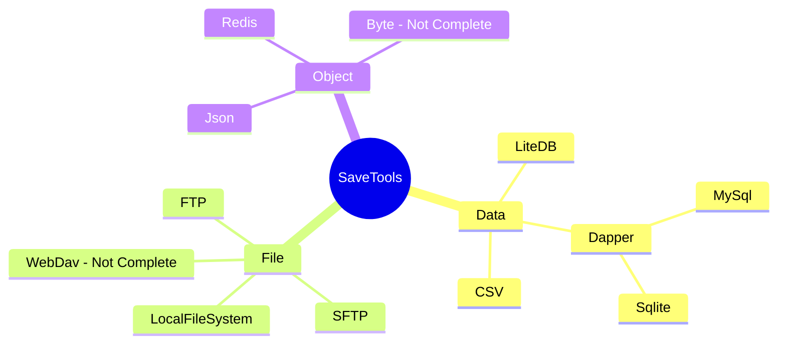

# SaveTools使用手册

---

注：SaveTools 目前因为接口反复修改的关系，Load方法增加对象的返回值以提供更多的操作方法。下面Not Complete表示该部分功能并未开发完毕。



## 支持的数据类型

- `Object` 对象类型的存储类型，通过key-value的方式获取对应的对象，常见的例子有Json，Redis等等。
- `Data`  数据类型的存储类型，同样通过key-Table的方式获取对应的数据表，通常为各种类型的数据库，比如MySql，Sqlite，LiteDB，CSV表格文件等等。
- `File` 文件类型的存储类型，提供对应的下载，上传接口以及各类文件系统管理接口，通常为各种文件共享服务，比如FTP，WebDav，本地文件系统等等。


## 加载存储管理对象（可读可写）

Load为可读写存储对象的加载，通常是用Path，或者数据库地址来进行实例化。

以SQLite数据库为例

```csharp
 EGSqliteSave SqliteTest = this.EGSave().Load<EGSqliteSave>("SaveData/test.db");
```

具体使用方法详见API - IEGSaveData部分。

## 读取存储管理对象（只读）

Read为只读存储对象的加载，通常以字符&字节流的方式来获取，由于是只读数据，仅包含相关数据的搜索，获取功能。

以Json为例

```csharp
string json = @"{
                'CPU': 'Intel',
                'PSU': '500W',
                'Drives': [
                    'DVD read/writer'
                    /*(broken)*/,
                    '500 gigabyte hard drive',
                    '200 gigabyte hard drive'
                ],
                'My' : {
                    'AA':'BB',
                    'Date': new Date(123456789)
                }
            }";
EGJsonSave jsonManage = this.EGSave().Read<EGJsonSave>("Example", json);
GD.Print(jsonManage.GetObject<string>("CPU"));
```

## 数据库增删改查

针对Data型的存储类型，可以简单实现数据库的增删改查，同时可使用Database的建表操作完成数据库的初始化。

```csharp
```


## 开发计划（随版本更新）

Object：

- [x] Json

- [x] Redis

- [ ] Byte

- [ ] etc...

Data：

- [x] LiteDB
- [x] Dapper
- [x] Sqlite
- [x] MySql
- [x] Csv
- [ ] etc...

File：

- [x] LocalFile
- [x] Ftp
- [x] SFtp
- [ ] WebDav
- [ ] etc...


# 使用案例

## 配置文件写入与加载


## 简易背包


## 数据库增删改查


## 使用CQRS实现可追溯的文件操作
