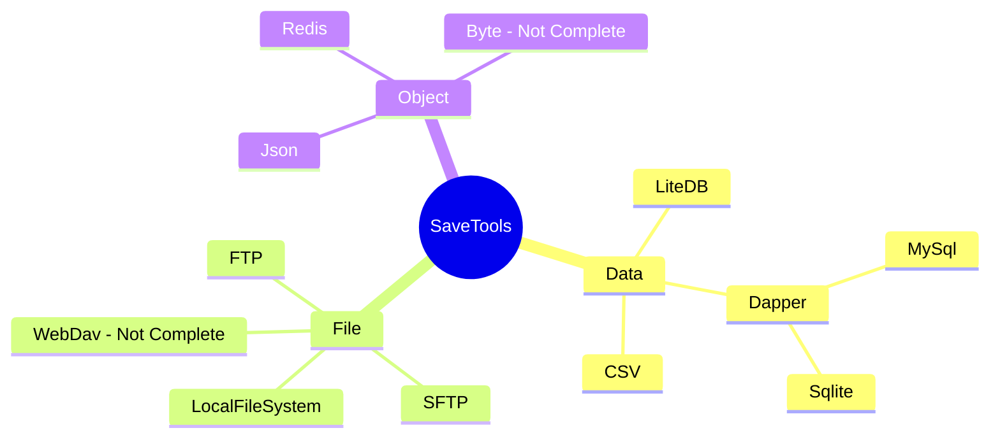

# SaveTools使用手册

---

注：SaveTools 目前因为接口反复修改的关系，Load方法增加对象的返回值以提供更多的操作方法。下面Not Complete表示该部分功能并未开发完毕。



## 支持的数据类型

- `Object` 对象类型的存储类型，通过key-value的方式获取对应的对象，常见的例子有Json，Redis等等。
- `Data`  数据类型的存储类型，同样通过key-Table的方式获取对应的数据表，通常为各种类型的数据库，比如MySql，Sqlite，LiteDB，CSV表格文件等等。
- `File` 文件类型的存储类型，提供对应的下载，上传接口以及各类文件系统管理接口，通常为各种文件共享服务，比如FTP，WebDav，本地文件系统等等。


## 加载存储管理对象（可读可写）

Load为可读写存储对象的加载，通常是用Path，或者数据库地址来进行实例化。

以SQLite数据库、Json文件为例

```csharp
//SQLite
EGSqliteSave SqliteTest = this.EGSave().Load<EGSqliteSave>("SaveData/test.db");

//Json
string SettingFilePath { set; get; } = "SaveData/Settings.json".GetGodotUserPath();
this.EGSave().LoadObjectFile<EGJsonSave>(SettingFilePath);
```

具体使用方法详见API - IEGSaveData部分。

## 读取存储管理对象（只读）

Read为只读存储对象的加载，通常以字符&字节流的方式来获取，由于是只读数据，仅包含相关数据的搜索，获取功能。

以Json为例

```csharp
string json = @"{
                'CPU': 'Intel',
                'PSU': '500W',
                'Drives': [
                    'DVD read/writer'
                    /*(broken)*/,
                    '500 gigabyte hard drive',
                    '200 gigabyte hard drive'
                ],
                'My' : {
                    'AA':'BB',
                    'Date': new Date(123456789)
                }
            }";
EGJsonSave jsonManage = this.EGSave().Read<EGJsonSave>("Example", json);
GD.Print(jsonManage.GetObject<string>("CPU"));
```


## 本地文件读写

针对Object型的存储类型，可以实现对Json文件的增删查改

定义我们要使用的数据类，以一个服务端设置信息为例

```csharp
public struct DataTargetServer
{
    public string ServerIP { set; get; }
    public int ServerPort { set; get; }

    public DataTargetServer()
    {
        ServerIP = "127.0.0.1";
        ServerPort = 8888;
    }
    public DataTargetServer(string ip, int port)
    {
        this.ServerIP = ip;
        this.ServerPort = port;
    }

}
```

检查&创建&存储数据

```csharp
//Json文件加载
string SettingFilePath { set; get; } = "SaveData/Settings.json".GetGodotUserPath();
this.EGSave().LoadObjectFile<EGJsonSave>(SettingFilePath);

//是否存在该Key值下的数据
if (this.EGSave().ContainsObject(SettingFilePath, "DataServer"))
{
    //获取对应数据
    DataServer = this.EGSave().GetObject<DataTargetServer>(SettingFilePath, "DataServer");
}
else
{
    //设置该数据
    this.EGSave().SetObject(SettingFilePath, "DataServer", new DataTargetServer());
}
```


## 数据库增删改查

针对Data型的存储类型，可以简单实现数据库的增删改查，同时可使用Database的建表操作完成数据库的初始化。

首先我们定义两个结构类型，其一是符合类型，带相关对象的：

```csharp
public struct DataStudent
{
    public int ID;
    public string Name { get; set; }
    public int Age;
    public EGPathSelect Path { set; get; }
    public DataStudent(string name, int age)
    {
        Name = name;
        Age = age;
        ID = 0;
        Path = new EGPathSelect();
    }
}
```

其二是只包含原始类型（IsPrimitive）和string类型的结构，其中类结构里面的所有属性（除了主键ID自增外）皆为属性类型。

```csharp
public struct DataStu
{
    public int ID;
    public string Name { get; set; }
    public int Age { set; get; }
    public string Path { set; get; }
    public DataStu(string name, int age,string path)
    {
        Name = name;
        Age = age;
        ID = 0;
        Path = path;
    }
}
```

后面我们会讲到两种类型兼容方面的差异，第一种仅支持单项操作，复数操作无法很好的兼容，第二种则支持复数操作（适用于数据批量导入，备份功能的定制）。

以MySQL为例：

### 数据库连接

```csharp
EGDapper mysqlSave = this.EGSave().Load<EGMysqlSave>("server=" + "localhost" + ";port=" + "3306" + ";uid=" + "root" + ";pwd=" + "root" + ";database=" + "Test3" + ";");
```

或者

```csharp
EGMysqlSave mysqlSave = this.EGSave().Load<EGMysqlSave>("server=" + "localhost" + ";port=" + "3306" + ";uid=" + "root" + ";pwd=" + "root" + ";database=" + "Test3" + ";");
```

### 查询表名是否存在

```csharp
bool isExist = mysqlSave.ContainsKey("DataStudent");
GD.Print(isExist);
```

### 查询对应ID的条目是否存在

```csharp
bool isExist = mysqlSave.ContainsData("DataStudent",3);
GD.Print(isExist);
```

### 初始化表

如果包含复合对象的，比如其它类对象的声明（例如上面的 EGPathSelect），此选项创建的字段为varchar(255)，同String。

```csharp
mysqlSave.CreateTable<DataStudent>("DataStudent");
```

### 增加数据

关于Path属性，会根据该类的ToString()方法，插入到表格对应的Path字段中。

```csharp
DataStudent stuData = new DataStudent("Bob", 12);
stuData.Path = new EGPathSelect(){Path = "AA"};
mysqlSave.AddData("DataStudent",stuData);
```

或者

```csharp
DataStu stu1 = new DataStu("Anti", 20,"London");
mysqlSave.AddData("DataStudent",stu1);
```

### 批量增加数据

注意，批量增加数据时，需要保证对象结构必须包含表字段的所有非空属性（此框架提供的建表方法字段默认非空）。其中类结构里面的所有属性（除了主键ID自增外）皆为属性类型。

```csharp
DataStu stu2 = new DataStu("CC", 23,"NewYork"){Age = 19};
DataStu stu3 = new DataStu("Rocket", 24,"Paris"){Age = 26};
List<DataStu> stuList = new List<DataStu>();
stuList.Add(stu2);
stuList.Add(stu3);
mysqlSave.AddData<DataStu>("DataStudent",stuList);
```

### 删除数据（通过ID）

删除ID为2的一条数据（可配合FindData找到要删除的内容的ID，实现批量删除）

```csharp
mysqlSave.RemoveData("DataStudent",2);
```

### 查找数据（通过表达式）

查找Name为CC的数据

```csharp
IEnumerable<DataStu> findStudent = mysqlSave.FindData<DataStu>("DataStudent", e => e.Name == "CC");
GD.Print(findStudent.Count() +" data has been find!");
foreach (DataStu stu in findStudent)
{
    GD.Print(stu.Path);
}
```

### 查找数据（通过关键词）

查找Name包含C的数据，注意：通过关键词查找的数据大小写不敏感，包含小写c也会被检索出来

```csharp
IEnumerable<DataStu> findStudent = mysqlSave.FindData<DataStu>("DataStudent","Name","C");
GD.Print(findStudent.Count() +" data has been find!");
foreach (DataStu stu in findStudent)
{
    GD.Print(stu.Path);
}
```

### 修改数据

查找所有Name字段包含CC的数据，并给名称增加编号。

```csharp
IEnumerable<DataStu> findStudent = mysqlSave.FindData<DataStu>("DataStudent","Name","CC");
GD.Print(findStudent.Count() +" data has been find!");
int count = 0;
foreach (DataStu stu in findStudent)
{
    DataStu NewData = new DataStu("CC_" + count, stu.Age, stu.Path);
    mysqlSave.UpdateData("DataStudent", NewData, stu.ID);
    count++;
}
```


## 开发计划（随版本更新）

Object：

- [x] Json

- [x] Redis

- [ ] Byte

- [ ] etc...

Data：

- [x] LiteDB
- [x] Dapper
- [x] Sqlite
- [x] MySql
- [x] Csv
- [ ] etc...

File：

- [x] LocalFile
- [x] Ftp
- [x] SFtp
- [ ] WebDav
- [ ] etc...


# 使用案例

## 配置文件写入与加载


## 简易背包


## 使用CQRS实现可追溯的文件操作
